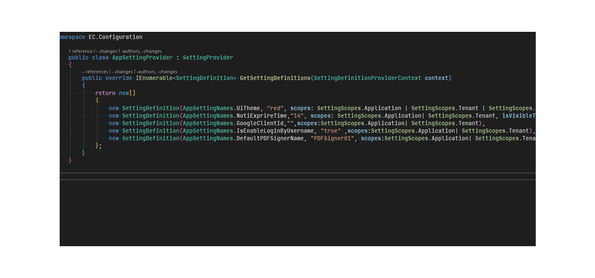

# Introduction

[ASP.NET Core & Angular](https://aspnetboilerplate.com/Pages/Documents/Zero/Startup-Template-Angular) (single page application). app to sign PDF documents.

  

# Screenshots


  

#### Table of Content

- [Setup](#setup)

- [Integration](#intergration)

- [Contributing](#contributing)

# Setup

- Requirement:

- [PostgresSQL](https://www.postgresql.org/download/)

- [NodeJS v16](https://nodejs.org/download/release/v16.20.2/)

- [AngularCLI](https://www.npmjs.com/package/@angular/cli)

- [.NET 6 SDK or ASP.NET Core RunTime](https://dotnet.microsoft.com/en-us/download/dotnet/6.0)

- [.NET Entity Framework tool](https://learn.microsoft.com/en-us/ef/core/cli/dotnet)

Before you start, make sure you have your own GoogleClientId, and change it in AppSettingProvider.cs(```aspnet-core\src\EC.Core\Configuration```). More information see: [Google Console](https://console.cloud.google.com/)


cd to folder **aspnet-core\src\ EC.EntityFrameworkCore** and run command below to migrate database

```shell
dotnet ef database update
```

- This project use LibreOffice to convert input document files to PDF format, for more information

visit [LibreOffice](https://www.libreoffice.org/download/download-libreoffice/) website.

On Windows enviroment, after install LibreOffice you need to add LibreOffice installation folder

to PATH (Enviroment variables).

Example: installation folder is **C:\Program Files\LibreOffice\program**

```shell
setx /M path "%path%;C:\Program Files\LibreOffice\program"
```

- To start Back-End cd to **aspnet-core\src\EC.Web.Host** and use command``` dotnet run```

or set **EC.Web.Host** is default start-up project and run normally in Visual Studio.

Your BE default URL is: ```http:\\localhost:44311```

- To start Front-End cd to **angular** run install command ```npm i --legacy-peer-deps```

then run ```ng s -open ``` to start Frond-End

Your BE default URL is: ```http:\\localhost:4200```

  

# Intergration

[SignServer](https://www.signserver.org/): Open-source signing software
# Lincense
[MIT](https://github.com/ncc-erp/metasign/blob/dev/LICENSE)
# Contributing

Fork and pull request! 😃

NOTE: If the project does not have an issue for what you want to do, create an issue first.

Feel free to submit [Github Issues](https://github.com/ncc-erp/metasign/issues) or pull requests.