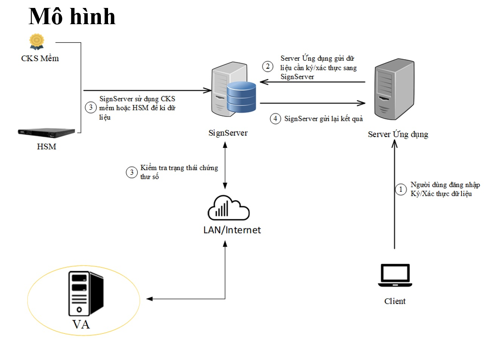
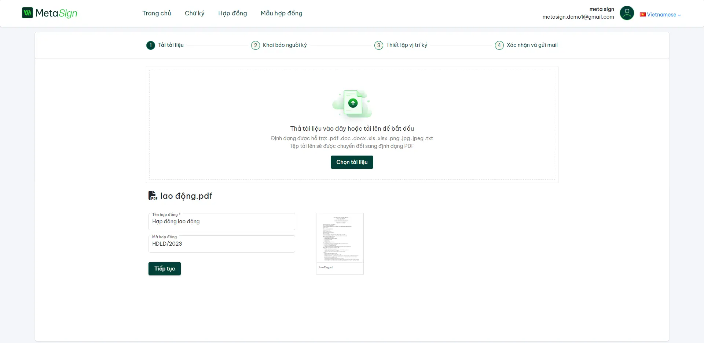
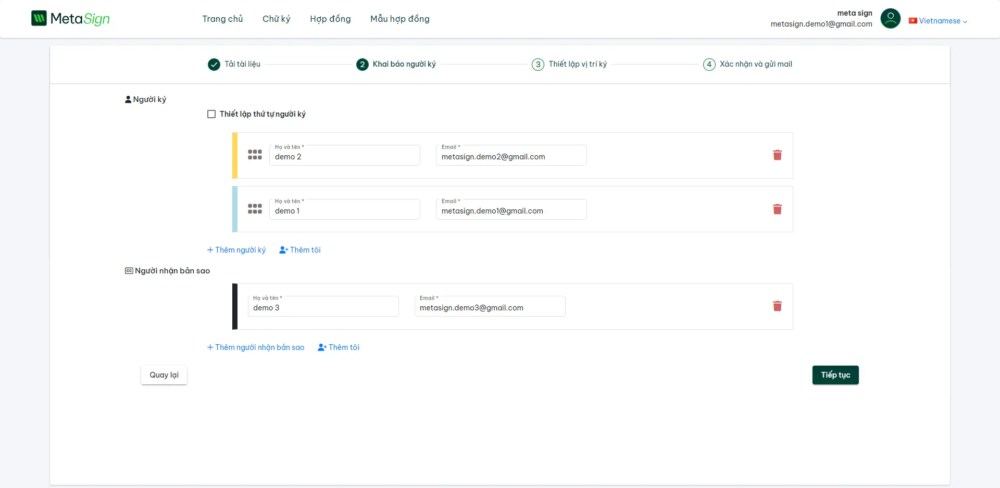
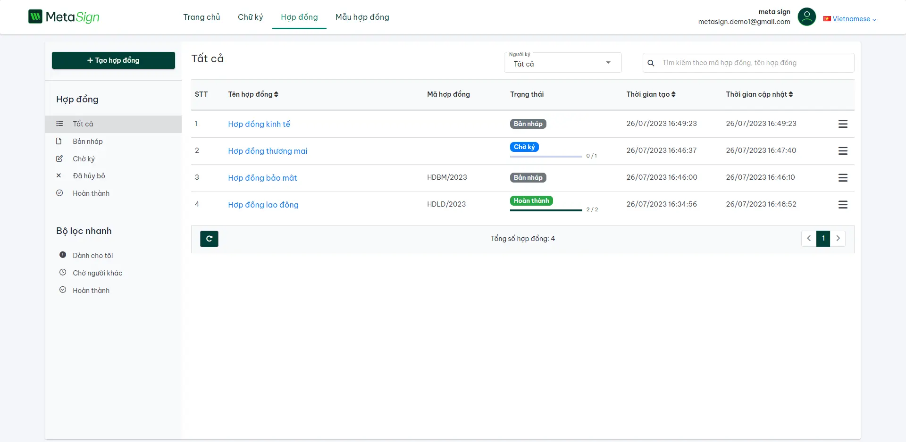

  

# Metasign
## Overview
Metasign is an e-contract solution to bring businesses and individuals a superior experience when engaging in contracts, and optimizing operation and management systems. 

Metasign can serve a wide range of customers' needs:
 - Creating different types of contracts easily
 - Delivering and getting back completed contracts via online channels
 - Storing, tracking, and managing contracts in a more convenient manner
 - Generating reports
 - Creating contracts in a batch

## signServer
signServer is an enterprise-grade electronic signature solution that enables digital signing of documents and contracts.  By leveraging signServer's standards-based signing capabilities, Metasign can assure customers of the authenticity, integrity and security of signed documents: 
 - standards-based signing capabilities, Metasign can assure customers of the authenticity, integrity and security of signed documents.
 - signServer enables digital signing that is compliant with global standards including eIDAS, UETA, and ESIGN Act.
 - It utilizes advanced PKI technology and adheres to certificate policies such as X.509, ensuring valid digital identities.
 - signServer leverages high-grade encryption algorithms like RSA and SHA-256 to secure documents and signatures.
 - Timestamps, digital seals, and digital certificate validation prevent tampering and ensure non-repudiation.


 
## Table of Contents

- [Metasign](#metasign)

  

- [Overview](#overview)


- [SignServer](#signServer)


- [Table of Contents](#table-of-contents)

  

    - [Getting Started](#getting-started)

  

    - [Prerequisites](#prerequisites)

  

    - [Clone project](#clone-project)

  

    - [Backend Setup](#backend-setup)

  

    - [Frontend Setup](#frontend-setup)

  

    - [Building](#building)

  

    - [Running](#running)

  

    - [Screenshot Tutorial](#screenshot-tutorial)

  

    - [Admin page](#admin-page)

  

    - [Basic user page](#basic-user-page)

  

  

## Getting Started

  

  

### Prerequisites

  

  

Before you begin, ensure you have met the following requirements:

  

  

- [Visual Studio 2022](https://visualstudio.microsoft.com/) installed.

  

- [.NET 6 SDK or ASP.NET Core RunTime](https://dotnet.microsoft.com/en-us/download/dotnet/6.0) installed.


- [Visual Studio Code](https://code.visualstudio.com/) installed.

  

- [Node.js 14.21.2](https://nodejs.org/en/blog/release/v14.21.2) and npm (Node.js Package Manager) installed.

  

-  [PostgresSQL](https://www.postgresql.org/download/) installed.

  

  

### Clone project

  

1. **Create a folder** to store the backend and frontend code.

  

- example: folder `metasign`

  

  

2. **Open a command prompt** in the created folder.

  

  

3. **Clone the backend repository** using the following command:

  

  

```bash
git clone https://github.com/ncc-erp/metasign.git
```

  

  

### Backend Setup

  

1. Open the backend solution using **Visual Studio 2022**:

  

  

- Launch `Visual Studio 2022`.

  

- Select `File` > `Open` > `Project/Solution.`

  

- Navigate to the backend folder within created folder `metasign` and open the solution file.

  

2. Restore NuGet packages:

  

  

- In Solution Explorer, right-click the solution and select **Restore NuGet Packages**.

  

3. **Set the startup project:**

  

  

- Navigate to the path `aspnet-core/src/EC.Web.Host` then right-click `metasign.Web.Host` in `Solution Explorer`.

  

Select **Set as StartUp Project**.

  

4. Update the `appsettings.json` file:


- Open the `appsettings.json` file in the backend project.


- Locate the `ConnectionStrings` section.


- Update the **Default** connection string to match your local database information:
 

```json
{
"ConnectionStrings":  {
"Default":  "Host=localhost;Port=5432;Database=metasign;User ID=yourUID;Password=yourPW;Pooling=true;"
},
// ... other settings ...
}

```
5. Generate your own local database :

- Go to the path ` Tools` > ` NuGet Package Manager`> `Package Manager Console`
- Change `Default project` with `src/EC.Web.Host`
- Run terminal
```bash
Update-database
```
- **Open sql server, you can see new created database.**
6.
- Press `F5` or select `Debug` > `Start Debugging` to run the backend.
- Press `Ctrl + f5` or select `Debug` > `Start without Debugging` to run the backend without debug
**Default port backend**: `http://localhost:44311/`
### Frontend Setup
1. Open Front-end repository
- Select `metasign` folder > `ncc-erp-metasign` > `angular`
- open code
```bash
code .
```
2. Install Angular CLI globally:
```bash
npm install -g @angular/cli
```
3. Install frontend dependencies:
```bash
npm install 
```
4. Run front-end
```bash
npm start
```
### Building
To build the project, follow these steps:
1.Build the backend using `Visual Studio Code` or the `command line`.
2.Build the frontend:

```bash
npm run build
```
### Running

To run the project, use these commands:

1. Start the backend using `Visual Studio Code` or the `command line`.

2. Start the frontend:

```bash
npm start
```
# Screenshot Tutorial

Check out our screenshot tutorial on how to use metasign:


